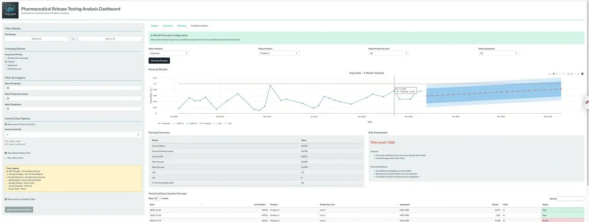
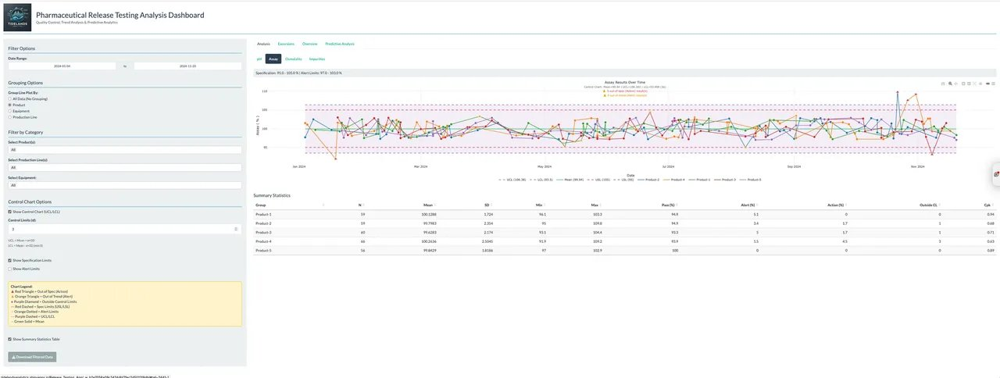
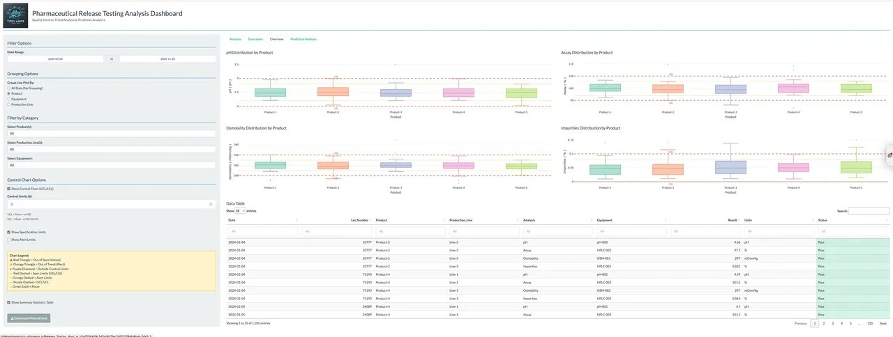
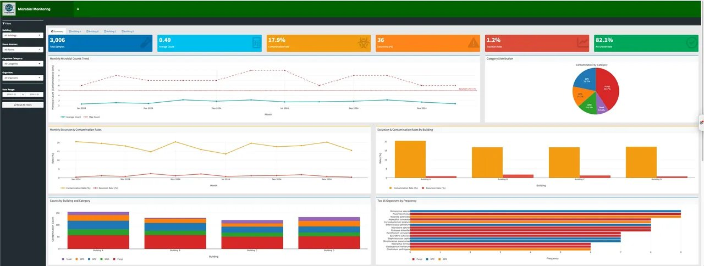

Each application below is a working example built for real analytical workflows. Click through to explore the live versions.

---

## Pharmaceutical Release Testing Dashboard

A multi-tab analytics platform for pharmaceutical QC laboratories. Combines statistical control charting, predictive forecasting, and risk-based decision support in a single workflow.

::: {.app-tabs}

::: {.grid}

::: {.g-col-12 .g-col-md-6}
{.app-screenshot}

**Predictive Analysis**
Forecasts upcoming results based on historical trends, with automatic risk classification.
:::

::: {.g-col-12 .g-col-md-6}
{.app-screenshot}

**Assay Control Charts**
Time-series control charting with UCL/LCL limits, specification bands, and product-level statistics.
:::

::: {.g-col-12 .g-col-md-6}
{.app-screenshot}

**Distribution Analysis**
Comparative distributions across products and analytes, with searchable underlying data tables.
:::

::: {.g-col-12 .g-col-md-6}
::: {.app-cta-card}

### Try it live

Explore the working dashboard with sample pharmaceutical QC data.

[Open Predictive Analysis →](https://tidelandsanalytics.shinyapps.io/Release_Testing_App/){.btn .btn-primary}

[Open Analytical Review →](https://tidelandsanalytics.shinyapps.io/Release_Testing_App/){.btn .btn-outline-primary}
:::
:::

:::

:::

**Built with:** R · Shiny · Plotly · DT · forecast

---

## Microbial Monitoring Dashboard

Environmental monitoring platform for cleanroom and production facilities. Tracks organism counts, contamination rates, and excursion patterns across multiple buildings.

::: {.app-tabs}

::: {.grid}

::: {.g-col-12 .g-col-md-7}
{.app-screenshot}
:::

::: {.g-col-12 .g-col-md-5}
**At a glance**

- Real-time KPI cards (sample counts, contamination rates, excursion alerts)
- Monthly trending with excursion limit overlays
- Building-by-building comparisons
- Top-N organism frequency analysis
- Category-level distribution charts

[Open the app →](https://tidelandsanalytics.shinyapps.io/Organism_Review/){.btn .btn-primary}
:::

:::

:::

**Built with:** R · Shiny · ggplot2 · Plotly · bslib

---

## Production Review

A production monitoring dashboard for tracking manufacturing metrics and operational performance.

[Open the app →](https://tidelandsanalytics.shinyapps.io/ProductionApp/){.btn .btn-outline-primary}

---

::: {.cta-section}

## Want something like this for your data?

Whether you're starting from spreadsheets or have years of data sitting in a database, we can help you turn it into something your team will actually use.

[Let's talk](contact.qmd){.btn .btn-light .btn-lg}

:::
